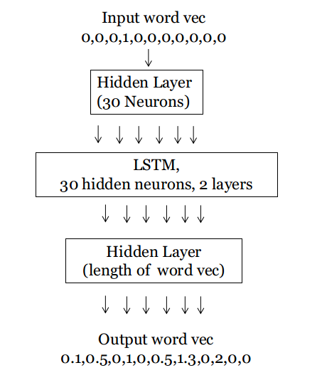
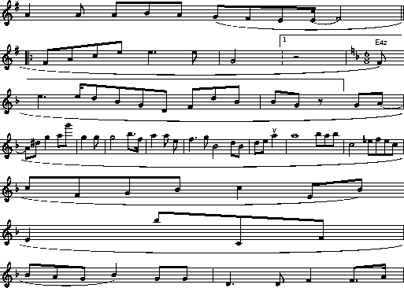
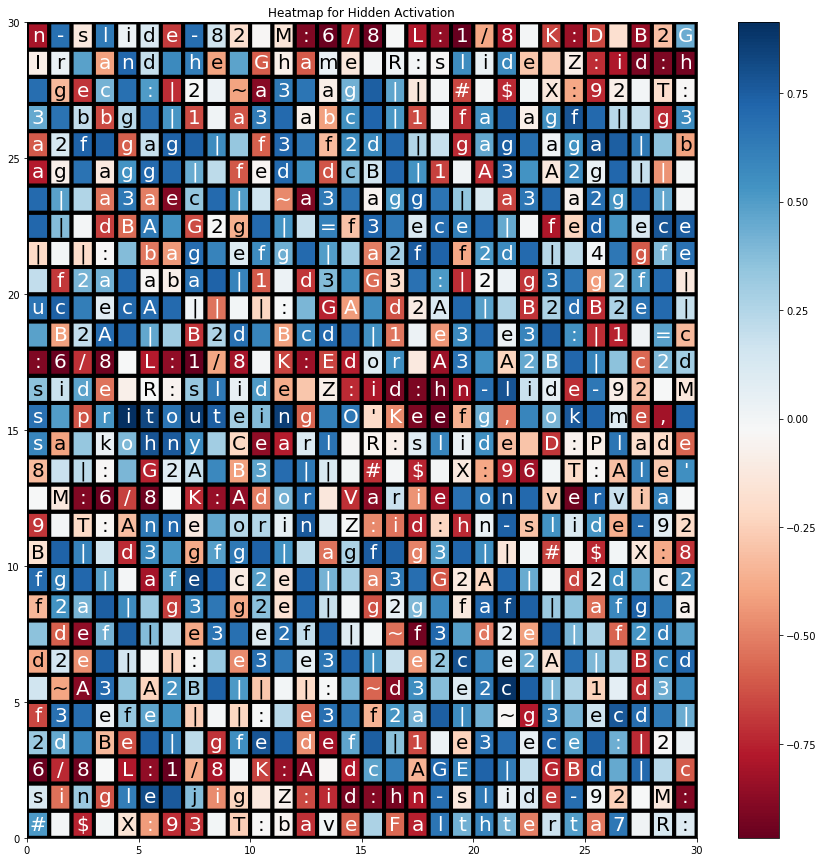

# RNN Music Generator

### A pytorch implementation of music generator using RNN structure

implemented a char-based generative LSTM model and trained it to “write” songs. 

## Network structure

## Examples

## Heat Plots

## Contributors
